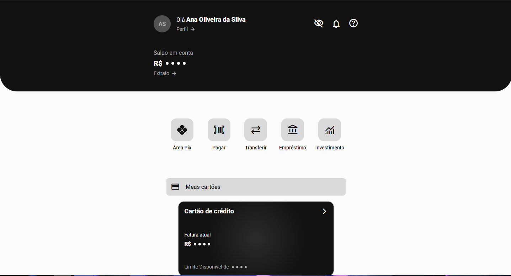
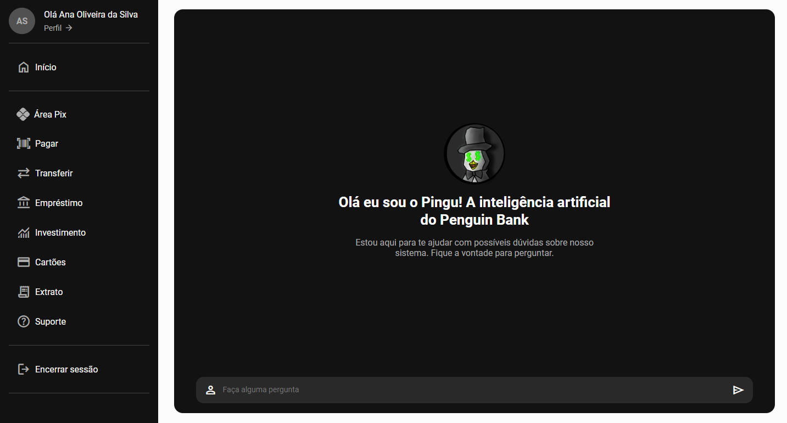

# Aplicação Penguin Bank Front-End
 

     
    
     
     <h2>Penguin Bank é um banco digital <i>Web</i> onde você terá diversos benefícios desde conta gratuita, empréstimos, transações, investimentos e muito mais. Venha ser um <b>Pinguim</b>.</h2>
     
     
    
     
     
    
     
     
    
     
     
    

 

  Este é um projeto desenvolvido para realização de um trabalho final de semestre na matéria Linguagem de Programação juntamente com Engenharia de Software I. No qual foi realizado em grupo de 5 integrantes 
  e consiste em desenvolver um sistema bancário tendo todo seu Back End desenvolvido na linguagem de programação ao qual é o coração do site, sendo realizado em C e SQLite,  para que fosse possível a 
  realização das regras de negócio da aplicação. 
   
   
  Por escolha do grupo optamos em aceitar um desafio maior com base no conhecimentos de cada integrante do grupo e desenvolvemos uma interface Web, o 
  Front End da aplicação no qual foi criado com as linguem de marcação HTML, CSS e a a linguagem de programação Javascript utilizando sua biblioteca JQuery, O grupo optou por não utilizar um framework 
  como React  por facilidade de execução do projeto em qualquer maquinha, já que o grupo não irar hospedar o sistema completo na Web.
   
   
  Já na criação do Back End de início teve grande complicação de como 
  usar uma API(Interface de Programação de Aplicação) a qual deriva se responsável por realizar a ponde de comunicação entra os dois lados da aplicação, pôs a linguem C não tem ferramentas necessárias passar essa criação, 
  assim necessitando utilizar diversas bibliotecas para realizar parte. Igual mente necessária para a conexão com o Banco de dados o qual também necessitou de bibliotecas externas para realizar a conexão, o SQLite que foi 
  escolhido por ser um banco digamos portável onde não requer um aplicativo para ele rodar. Por fim no repositório desta organização no GitHub está dividido em dois o Front End. e o Back End. 

# Detalhes do Back End

# Como Instalar?

  Para instalar a aplicação use o código no seu CMD(Prompt de Comando):

    git clone https://github.com/Projeto-Banco-em-C/aplicacao-front-end.git

Apos isso é dentro da pasta abra o arquivo `index.html` isso com o servidor Back End rodando! o qual o passo a passo de como rodar está esplicado  <a href="https://github.com/eduardofranco572">aqui</a>
 
 

   
  
Linguagens utilizadas para a aplicação

  
  
  
  
   
  

 
 
# Integrantes do Grupo

  <ul>
    <li>
      Eduardo Franco Seco  
      
         
    </li>
    <li>
      Igor Albiero  
      
         
    </li>
    <li>
      Leonardo Aparecido Modesto  
      
         
    </li>
    <li>
      João Victor da Silva  
      
         
    </li>
    <li>
      Felipe de Solza Pereira  
      
         
    </li>
  </ul>

